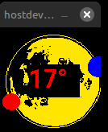

ESPHome_Sun_and_Moon
====================

How to calculate the Sun and Moon positions - altitude, azimuth, phase, images, icons, etc - using ESPHome on an ESP32 device.


Quick Install
-------------

1. include the astro.yaml package in a "packages:" component (place the file in common/config).
```yaml
packages:
  astro: !include 
    file: common/astro.yaml
    vars:
      entity_prefix: "astro_"

```
2. In your device .yaml file, call the sunMoonCoords script periodically using the interval component with your location (longitude and latitude).
```yaml
interval:
  - interval: 2min
    then:
      - script.execute:
          id: Astro_sunMoonCoords
          astro_latitude: 44.2307
          astro_longitude: -76.4813            
```
3. (optional) Define the Moon phase glyphs in an icon font if you print the moon phase icon
```yaml
  - file: 'fonts/materialdesignicons-webfont.ttf'
    id: icons
    size: 26
    glyphs: [
      󰽤, # moon-new
      󰽧, # moon-waxing-crescent
      󰽡, # moon-first-quarter
      󰽨, # moon-waxing-gibbous
      󰽢, # moon-full
      󰽦, # moon-waning-gibbous
      󰽣, # moon-last-quarter
      󰽥, # moon-waning-crescent
     ]
```

Calculating The position of the Sun and the Moon
------------------------------------------------

ESPHome has a Sun platform, but there is no built-in method to compute the Moon position (right ascension, declination, altitude and azimuth, phase, etc).
There is also no way to determine the sun and moon position without a Home Assistant connection for a standalone (WiFi only) device, or for a moon clock that moves servo motors.

With this repository, it is possible to compute the Sun and Moon positions using the "astro.h" header file and the sensors and script in the "astro.yaml" file.

The formulas are adapted from "suncalc.js", a Javascript library by Vladimir Agafonkin (see [suncalc](https://github.com/mourner/suncalc) on Github),
and from Greg Miller's Astronomy Programming page [Greg Miller] (https://astrogreg.com/).

This repository contains:
- a .h file (astro.h) containing astronomical functions.
- a .yaml file (astro.yaml) with the script, sensors, and number definitions.
- a .h file (moon_icon.h) to calculate the moon icon for each moon phase (based on the Moon Age in days).
- a "MoonPhaseImages" folder containing a set of daily moon images - large (730x730 pixels, ~40kb) and small (135x135 pixels, ~3kb).
- a "hostdevice.yaml" example for a host device example using a 128x128 display.
- a "gauge1.yaml" example for a Spotpear desktop trinket with an attached 1.44inch 128x128 TFT color LCD screen.

The Common Astronomical functions
---------------

The "astro.h" file defines a set of common astronomical functions to calculate right ascension, declination, altitude and azimuth for the sun and moon.
It is included into the user's yaml file by the "astro.yaml" package.

The only required inputs are the user's longitude and latitude, which are supplied in the call to the sunMoonCoords script.

The "astro.h" file is just 150 lines of C++, which defines straightforward "Astro::"-prefixed common functions.
The "astro.yaml" file contains the script (sunMoonCoords) and the sensor and number definitions.
The functions in "astro.h" are used by the script, numbers, and sensors in the "astro.yaml" package.
The "astro.h" and "astro.yaml" files must be in your config directory so that ESPHome can find it when you compile and install device firmware.

Setting up Sun and Moon sensors
-------------------------------

In order to use the "Astro::" functions, a set of scripts, numbers and sensors are required.
These are defined in the "astro.yaml" file (which is placed in the user's config directory for ESPHome).
This file is included into the user's device yaml file using the "packages:" component.

```yaml
packages:
  astro: !include 
    file: common/astro.yaml
    vars:
      entity_prefix: "astro_"
```

New Sun and Moon sensors are added in the "sensors:" component of the user's device yaml from the "astro.yaml" package.
Note the sensor id's expanded from the entity_prefix var in the packages component - these id's must not conflict with user-defined sensor id's.
These sensor id's can be used (for example) in display printf statements.

Note that the right ascension, declination, azimuth and altitude sensors are in radians, and the states must be multiplied by 180/pi to get degrees.

Note also that the right ascension and azimuth sensor values range from -180 to +180 degrees. To get a range from 0 to 360, we add 180 to the sensor values (see astro.yaml).

Examples of printf logfile statements that output the sensor values in degrees are found within the astro.yaml, hostdevice.yaml and the gauge1.yaml sample files.

The Sun and Moon sensors are:
- Sun Right Ascension, id: ${entity_prefix}sun_ra
- Sun Declination, id: ${entity_prefix}sun_dec
- Sun Azimuth, id: ${entity_prefix}sun_az
- Sun Altitude, id: ${entity_prefix}sun_alt
- Moon Declination, id: ${entity_prefix}moon_dec
- Moon Right Ascension, id: ${entity_prefix}moon_ra
- Moon Azimuth, id: ${entity_prefix}moon_az
- Moon Altitude, id: ${entity_prefix}moon_alt
- Moon Phase, id: ${entity_prefix}moon_phase
- Moon Illumination, id: ${entity_prefix}moon_illumination
- Moon Phase Name, id: ${entity_prefix}moon_phase_name

A time platform is also defined in the "time:" component.  It is used by the astro_ functions for the timestamp.
- Time, id: ${entity_prefix}time

A template number is added in the "number:" component:

- Moon Age - id: ${entity_prefix}moonage

A text sensor is added in the "text_sensor" component:

- Moon Phase Name, id: ${entity_prefix}moon_phase_name

Updating the astro sensors
--------------------------

A sunMoonCoords script is provided in the "astro.yaml" package to calculate the values of the various Sun and Moon sensors.

The script is called in the user's device .yaml file on a periodic basis to recalculate the present Sun and Moon positions.
For example, the "interval:" component below calls the sunMoonCoords script to update the sun and moon sensors every two minutes.
The latitude and longitude should be replaced with the observer's location.

## Example interval component
```yaml
  - interval: 2min
    then:
      - script.execute:
          id: sunMoonCoords
          astro_latitude: 44.2307
          astro_longitude: -76.4813
```

The hostdevice.yaml example
---------------------------

The "hostdevice.yaml" file shows how the "astro.yaml" package is used in a host platform device.

[ESPHome Host Platform] (https://esphome.io/components/host/)

This example generates an azimuth display of the sun and moon on a full moon image background.
This display is very much like a custom Compass card in Home Assistant.

[Compass Card](https://github.com/tomvanswam/compass-card)

The moon icon shown on the azimuth display changes with the phase of the moon.
The number at the centre of the azimuth display is the altitude of the moon.
The background of the azimuth display is a full moon image (included in the set of moon images).

The display alternates between the azimuth display and a page showing the current altitude and azimuth values of the Sun and Moon.
The Sun and moon icon positions are updated every two minutes.
The host device log lists more detailed sensor information on the Sun and Moon.

For example:
```
[09:54:05][I][Astro:029]: Timestamp 1767884045 seconds
[09:54:05][I][Astro:032]: Offset to UTC 5.000000 hours
[09:54:05][I][Astro:033]: User Location: Latitude 44.2 Longitude -76.5
[09:54:05][I][Astro:038]: Moon Age 19.801868 days
[09:54:05][I][Astro:189]: Sun Right Ascension: 289.387602°
[09:54:05][I][Astro:211]: Sun Declination: -22.243392°
[09:54:05][I][Astro:143]: Sun Azimuth: 146.670603°
[09:54:05][I][Astro:166]: Sun Altitude: 16.320541°
[09:54:05][I][Astro:200]: Moon Right Ascension: 174.638088°
[09:54:05][I][Astro:222]: Moon Declination: 1.676937°
[09:54:05][I][Astro:155]: Moon Azimuth: 264.207237°
[09:54:05][I][Astro:178]: Moon Altitude: 8.310745°
[09:54:05][I][Astro:131]: Moon Phase: 113.478778°
[09:54:05][I][Astro:120]: Moon Illumination 69.9%
[09:54:05][I][Astro:231]: Moon Phase Name: Waning Gibbous
[09:54:05][I][Astro:087]: Sun transit: 11.957352 rise: 7.430626 set: 16.484077 
[09:54:05][I][Astro:094]: Moon transit: 4.307384 rise: 22.210144 set: 10.404623 
[09:54:05][I][hostdevice:040]: Moon X: 0.28 pix
[09:54:05][I][hostdevice:047]: Moon Y: 59.45 pix
[09:54:05][I][hostdevice:052]: Moon icon: 󰽦   hex
[09:54:05][I][hostdevice:059]: Sun X: 91.22 pix
[09:54:05][I][hostdevice:066]: Sun Y: 106.95 pix
```
Here is the compass card-like page shown on the hostdevice display:



The gauge1.yaml example
-----------------------

The gauge1.yaml file shows how the astro.yaml package is used in a typical ESPHome device.
The device in this case is a Spotpear desktop trinket with an ESP32C3 and an attached 128x128 display.
To use this yaml on your own device, note that the IP address and OTA password would need to be updated to your desired device id and password.

[Spotpear Desktop Trinket](https://spotpear.com/shop/ESP32-C3-desktop-trinket-Mini-TV-Portable-Pendant-LVGL-1.44inch-LCD-ST7735.html)

This device is perfect for displaying the current moon phase image on a Compass-card like azimuth display.
The Moon Phase image is renewed every hour, and would change every day based on the moon age.
The Moon phase icon and a circle icon for the Sun move around on the azimuth display as the azimuth of the Sun and Moon change during the day.
The number in the centre of the moon image shows the current altitude of the Moon.

As with the host device, the log file prints out the values of the Sun and Moon sensors every two minutes.
The device also has a web page which shows the current value of the Sun and Moon sensors and numbers.

The device requires only a WiFi connection, and through that a connection to an SNTP time server.
No Home Assistant connection is absolutely required, but one is used for LAN access to the Moon Phase images in the Home Assistant www folder.
The MoonPhaseImages folder from this repository should be uploaded to the www folder on your Home Assistant server.
If you place the Moon Images on a different server, modify the image_url in the astro.yaml file:

## Online Image component in gauge1.yaml
```yaml
# online image
online_image:
  - id: my_online_image
    url: "http://homeassistant.local:8123/local/MoonPhaseImages/Moon7small.jpg"
```

ESPHome is used to program and download the firmware to the device.
This means that the device could be used to show a Moon Clock, or to control servo motors to point to the Sun or Moon Position,
or for any other mechanical device that requires those positions (like a Tellurion).
While the device is not accurate enough to drive a telescope mount, it is typically within 2 degrees of the actual Moon Position.

The device would continue operating if the WiFi connection (and the connection to the SNTP time server) is severed after boot, losing perhaps a few seconds of accuracy per day.

With a real-time clock module, the device could even run completely offline after time initialization.
With a lithium battery pack, this trinket could run as a keychain fob.


