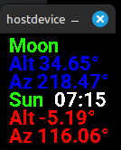

# ESPHomeSunMoon
Calculate the Sun and Moon positions - altitude, azimuth, phase, images, icons, etc - using ESPHome on an ESP32 device.

This repository contains the complete Astro package: .h header files and a .yaml file which calculate the sun and moon positions.

The repository does not require a connection to Home Assistant - only WiFi to provide an SNTP time.

Full Details:
[ESPHomeSunMoon README](./ESPHomeSunMoon.md)
