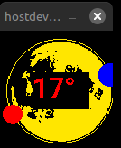
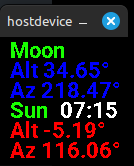

# ESPHomeSunMoon
Calculate the Sun and Moon positions - altitude, azimuth, phase, images, icons, etc - using ESPHome on an ESP32 device.

The calculations of the positions are performed entirely on the ESP32 device - no "api:" connection is required.

This is especially useful if you wish to display the Sun and Moon position on an attached display, or to move servo motors without a connection to a server.

This repository contains the Astro package of two .h header files and a .yaml file.
Install the astro.yaml package using a "packages:" component in your device ".yaml" file.

The repository does not require a connection to a Home Assistant server - only a WiFi connection to provide an SNTP time.

Optionally, Moon phase images can be downloaded to the ESP32 from a Home Assistant server using the "online_image:" component.

Two examples are included in this repository.

Full Details:
[ESPHomeSunMoon README](./ESPHomeSunMoon.md)
